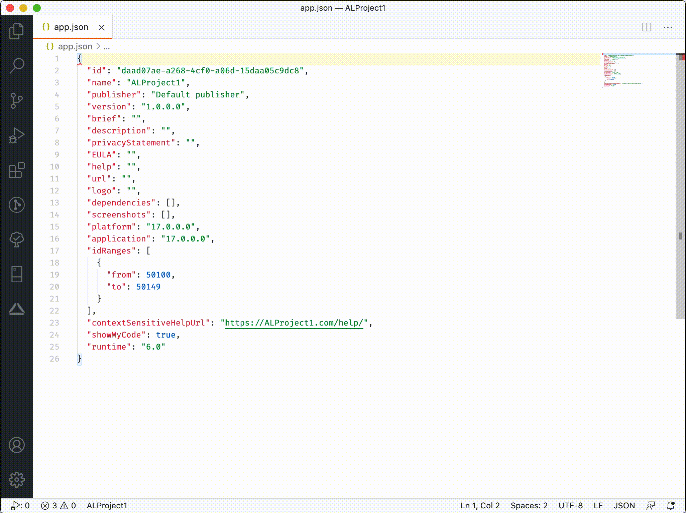

# AL ID Range Manager (VS Code extension)

This VS Code extension provides quick and centralized object id assignment using any API (for example Microsoft Dynamics 365 Business Central API). The corresponding Microsoft Dynamics 365 Business Central extension that support all processes is also on GitHub: <https://github.com/TKapitan/ALRM-BusinessCentral>.

## Features

### ALRM: Initialize

Creates an extension record in connected Business Central instance. Id, name and brief from the app.json file in the currently selected workspace are stored in BC.

Based on setup (see Extension Setting) range code may be required during the initialization process. Different object ranges can be specified for range codes in BC. There is also an option to choose a prefix to check all object names before a new id is assigned.

### ALRM: Synchronize

Synchoronize is a command that scan all AL files in the project and register all of existing objects (and fields for table and enum extensions). The extension has to be initialized first, than it is possible to run this command (may taky up to 10 minutes based on number of existing AL objects.).

The project has to met all defined rules on corresponding Assignable Range (object ID range, field ID range, object name structure and object ID and name uniqueness). If there are any error, other objects are synchronized and all errors are showned to the user once the synchronization ends.

The project (all objects) is scanned each time the command is run. The scanning and registering are done synchronously. Deleting of object field/values or deleting of objects is not supported.

### ALRM: New object

Creates object record of selected type and name in connected Business Central instance. New untitled file is created and initialized with corresponding standard AL language object snippet and object id assigned by BC.

Since v0.3.1 the command filter object types based on runtime version specified in app.json (users are not able to choose object type that is not available for project runtime).

### ALRM: New object extension field or value

Creates an extension object line record in connected Business Central instance. Only usable in table extensions and enum extensions. Creates a new field or enum value at current cursor position with id provided by BC.

## Requirements

To use this VS Code extension, you must set API connection to the backend system that store, validate & manage all extension objects & fields details.

We prepared Microsoft Dynamics 365 Business Central Extension that  met all requirements and is designed to work together with this VS Code extension. The source codes could be found on GitHub: <https://github.com/TKapitan/ALRM-BusinessCentral>

However, this VS Code extension could be used with your own backend side, created in the Business Central or using any other programming language.

To use this extension, the API must provide:

- API endpoints (currently, only ODATA api format is supported)
  - extensions
    - The API endpoint must process POST create
      - The create request contains data
        - id
          - Guid
          - Guid of the extension, is used as a key. The value is automatically loaded from the app.json file.
        - rangeCode
          - String
          - Code of the ranges that should be used to assign IDs.
          - Is used only when the "Assignable Ranges" is set to "API".
        - name
          - String (250 characters)
          - Name of the extension automatically loaded from app.json
        - description
          - String (250 characters)
          - Description of the extension automatically loaded from app.json
    - The API endpoint must process two actions (POST requests)
      - Microsoft.NAV.createObject
        - Accept three parameters (newly created object identification without the ID) and return ID of the object as a number.
        - Parameters
          - objectType
            - String
            - Specifies type of the newly created object.
            - In the format of Business Central objects (for example: Table/TableExtension/...).
          - objectName
            - String
            - Specifies name of the newly created object.
          - extendsObjectName (since v1.1)
            - String
            - Specifies name of object that is extended by newly created extension object. The field must be filled in for extension objects only.
          - createBy
            - String (50 characters)
            - Specifies user identification who did the request.
        - Return Value
          - Number
          - ID of the newly created object, will be automatically inserted to the created object.
      - Microsoft.NAV.createObjectFieldOrValue (replacing Microsoft.NAV.createObjectLine from v0.3.1)
        - Accept three parameters (object identification in which the field should be created and user who did the request) and return ID of the field as a number.
        - Parameters
          - objectType
            - String
            - Specifies type of the object in which we want to create a field.
            - In the format of Business Central objects (for example: Table/TableExtension/...).
          - objectID
            - String
            - Specifies ID of the object in which we want to create a field.
          - createBy
            - String (50 characters)
            - Specifies user identification who did the request.
        - Return Value
          - Number
          - ID of the newly created field, will be automatically inserted to the created field.
      - Microsoft.NAV.createObjectWithOwnID
        - Accept four parameters (newly created object identification with ID). No return value.
        - Parameters
          - objectType
            - String
            - Specifies type of the newly created object.
            - In the format of Business Central objects (for example: Table/TableExtension/...).
          - objectID
            - String
            - Specifies ID of the object which we want to register
          - objectName
            - String
            - Specifies name of the newly created object.
          - extendsObjectName (since v1.1)
            - String
            - Specifies name of object that is extended by newly created extension object. The field must be filled in for extension objects only.
          - createBy
            - String (50 characters)
            - Specifies user identification who did the request.
        - Return Value
          - Nothing
      - Microsoft.NAV.createObjectFieldOrValueWithOwnID (new in v0.3.1)
        - Accept four parameters (object identification in which the field should be created, new field/value ID and user who did the request). No return value.
        - Parameters
          - objectType
            - String
            - Specifies type of the object in which we want to create a field.
            - In the format of Business Central objects (for example: Table/TableExtension/...).
          - objectID
            - String
            - Specifies ID of the object in which we want to create a field.
          - fieldOrValueID
            - String
            - Specifies ID of the field or value we want to register
          - createBy
            - String (50 characters)
            - Specifies user identification who did the request.
        - Return Value
          - Nothing
  - assignableRanges
    - Is used only when the "Assignable Ranges" is set to "API".
    - The API endpoint must process GET
      - Without filters
      - Response must contain
        - code
          - String
          - Identification of assignable ranges that could be used for creating a new extension.
          - The value is later used as a parameter "rangeCode" in the "extensions" API endpoint for POST create method.
      - Response can also contain some other useful information. These fields are not necessary. All these fields are used for description when new extension is initialized and user is asked to choose the assignable range. Default assignable range is shown first (as default).
        - description
          - String
        - defaultObjectRangeFrom
          - Number
        - defaultObjectRangeTo
          - Number
        - default
          - String

## Extension Settings

- **al-id-range-manager.baseUrl**: DEPRECATED: Base Url Without Version  
  - Specifies URL of the APIs without specific API version and/or company
  - Format (for usage with Microsoft Dynamics 365 Business Central On-Premises)
    - `https://{server}:{port}/{instance}/api/teamARTAAAE/extension/`
  - Format (for usage with Microsoft Dynamics 365 Business Central Online / Cloud)
    - `https://api.businesscentral.dynamics.com/v2.0/{domain}/{environment}/api/teamARTAAAE/extension/`
    - Example:
      - `https://api.businesscentral.dynamics.com/v2.0/kepty.cz/production/api/teamARTAAAE/extension/`
- **al-id-range-manager.apiVersion**: API Version
  - Specifies version of used API. The API version must be available in BC.
  - In the Business Central it is possible to define minimal used API version for communication. In that case, lower/older versions can not be used and hence this setting must be changed by user to the newer version.
- **al-id-range-manager.tenant**: Tenant
  - Specifies tenant on which the API is hosted. Default value is "default".
- **al-id-range-manager.companyId**: Company Id
  - Specifies ID of the company for API URL. The value must be company ID without leading/ending "{}".
  - If there are only one company accessible with provided authentification, the value can be blank.
  - If the instance's default company should be used, the value can be also blank.
- **al-id-range-manager.authenticationType**: API Authentication Type
  - Specifies type of the authentification the API require
  - Basic auth is the only currently supported authentification method.
- **al-id-range-manager.username**: API Username
  - Specifies username for autentification in the API
- **al-id-range-manager.password**: API Password
  - Specifies password for autentification in the API
- **al-id-range-manager.assignableRange**: Assignable Ranges
  - Specifies how the assignable ranges should be used.
  - Values
    - API: Using this value, the assignable range will be mandatory.
    - Do Not Use: Using this value, the assignable range will be skipped.

### Deprecated Settings (still available)

- **al-id-range-manager.baseUrl**: DEPRECATED: Base URL  
  - DEPRECATED SINCE 0.4.1, will be removed 2021/Q3.
  - Specifies URL of the APIs
  - Format (for usage with Microsoft Dynamics 365 Business Central)
    - `https://{server}:{port}/{instance}/api/teamARTAAAE/extension/v1.0/`

## Known Issues

There are no known major issues
For list of minor issues and upcoming changes see <https://github.com/TKapitan/ALRM-VSCode/blob/master/CHANGELOG.md#unreleased>

## Release Notes

See [changelog](https://github.com/TKapitan/ALRM-VSCode/blob/master/CHANGELOG.md)
